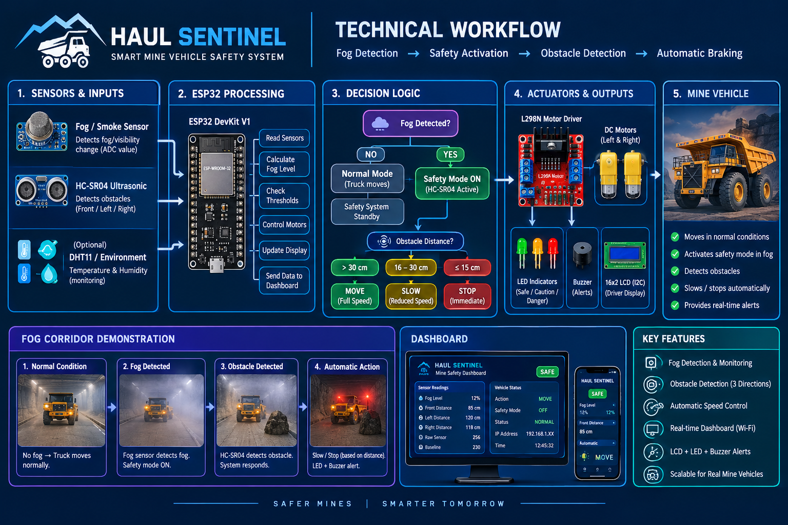

# 🚨 MineSafe – Smart Mine Vehicle Safety System
# MineSafe-SIH2026
Smart Mine Vehicle Safety System developed for Smart India Hackathon 2026 – SIH26007.
### Smart India Hackathon 2026 | SIH26007

MineSafe is a smart mine vehicle safety system designed to improve
the safety of mining vehicles and workers, particularly under
low-visibility conditions such as fog, dust and heavy rain.

---

## 🎯 Problem Statement

Mining operations involve heavy vehicles and workers operating in
challenging environmental conditions. Low visibility can increase
the risk of collisions and accidents.

MineSafe aims to provide an additional layer of safety through
obstacle detection, environmental sensing, warning systems and
control-room monitoring.

---

## 💡 Proposed Solution

Our system follows the workflow:

Sensors
↓
Data Collection
↓
Risk Analysis
↓
Distance Calculation
↓
Driver Warning
↓
Vehicle Safety Control
↓
Control Room Alert

---

## 🔧 Prototype

Our prototype uses:

- ESP32
- Ultrasonic sensors
- Environmental/fog sensing
- Motor driver
- DC motors
- LCD display
- LEDs
- Buzzer

The prototype demonstrates obstacle detection and automatic
vehicle safety responses.

---

## 📡 Proposed Final System

For the future full-scale system, ultrasonic sensing can be
replaced or supplemented by long-range radar sensing.

Additional technologies can include:

- Radar
- GPS
- Cameras
- Thermal imaging
- AI/ML
- V2V communication
- Control-room monitoring

---

## 🖥️ Control Room

The proposed monitoring dashboard can provide:

- Vehicle identification
- Vehicle status
- Obstacle distance
- Environmental conditions
- Location
- Safety alerts
- Real-time monitoring

---

## 🎥 Prototype Demonstration

[▶️ Watch the Prototype Demonstration](https://youtu.be/GOyQf_GNT7Q?si=lMpuvu57elyIRo-8)

---

## 📊 Technical Workflow

---

## 🏆 SIH 2026

**Problem Statement:** SIH26007

**Event:** Smart India Hackathon 2026

**Achievement:** Qualified through the Internal Hackathon

---

## 👨‍💻 Team

Add your team members here.

---

## 🚀 Future Scope

- Long-range radar-based detection
- AI-based collision-risk prediction
- GPS-based fleet tracking
- Thermal cameras
- V2V communication
- Advanced control-room monitoring
- Integration with mining fleet management systems
